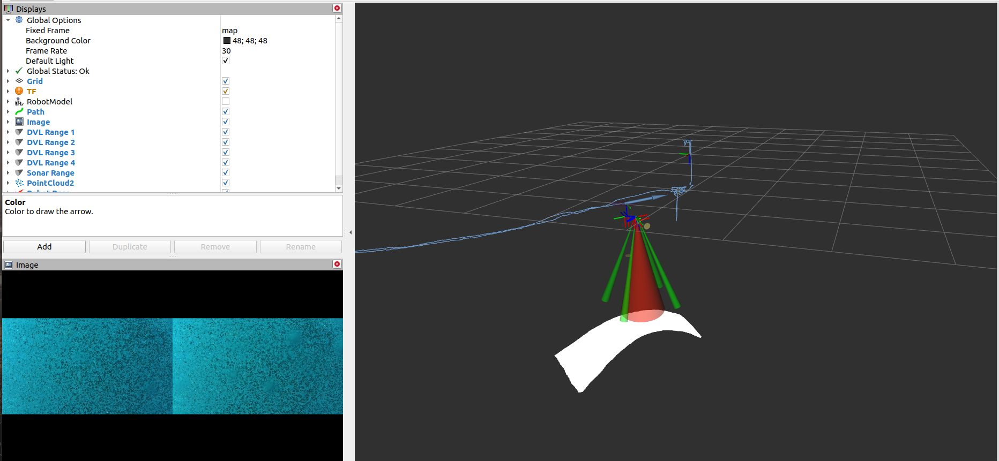

# BlueROV2 Visualization
Repository to visualize the sensor outputs from the BlueRov2.

To run, make sure that you need a rosbag. The rosbag should ideally have the following messages:
```
topics:      /camera/camera_info                                   : sensor_msgs/CameraInfo                 
             /camera/image_raw/compressed                          : sensor_msgs/CompressedImage            
             /dvl/data                                             : waterlinked_a50_ros_driver/DVL         
             /dvl/local_position                                   : geometry_msgs/PoseWithCovarianceStamped
             /fluid_pressure                                       : sensor_msgs/FluidPressure              
             /path                                                 : nav_msgs/Path                          
             /ping_sonar/data                                      : ping_sonar/SonarEcho                   
             /ping_sonar/profile                                   : ping_sonar/SonarEchoProfile            
             /state                                                : geometry_msgs/PoseWithCovarianceStamped
             /tf                                                   : tf2_msgs/TFMessage                     
             /zedm/zed_node/disparity/disparity_image              : stereo_msgs/DisparityImage             
             /zedm/zed_node/imu/data                               : sensor_msgs/Imu                        
             /zedm/zed_node/left/camera_info                       : sensor_msgs/CameraInfo                 
             /zedm/zed_node/right/camera_info                      : sensor_msgs/CameraInfo                 
             /zedm/zed_node/right_raw/image_raw_color/compressed   : sensor_msgs/CompressedImage            
             /zedm/zed_node/stereo/image_rect_color/compressed     : sensor_msgs/CompressedImage            
             zedm/zed_node/left_raw/image_raw_color/compressed     : sensor_msgs/CompressedImage
```
Use [`svo_utils`](https://github.com/umfieldrobotics/svo_utils) to obtain such rosbags.
## Running the Visualizer
On one terminal:
```
roslaunch bluerov_visualizer bringup_robot.launch
```
Then, on another terminal:
```
rosbag play <ROSBAG_NAME>.bag
```
The expected output should look like the following:

